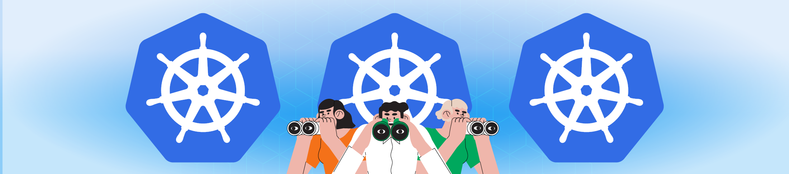

# Hey, I'm Aditya! 👋

I am a Cloud DevOps Engineer. I specialize in IT infrastructure management, crafting scalable architectures, enhancing security, integrating DevOps practices, streamlining development processes, and reducing cloud costs.

[**CKA: Certified Kubernetes Administrator**](https://www.credly.com/badges/73b7b72b-7d34-44ec-beb2-745267c39b7d/)
